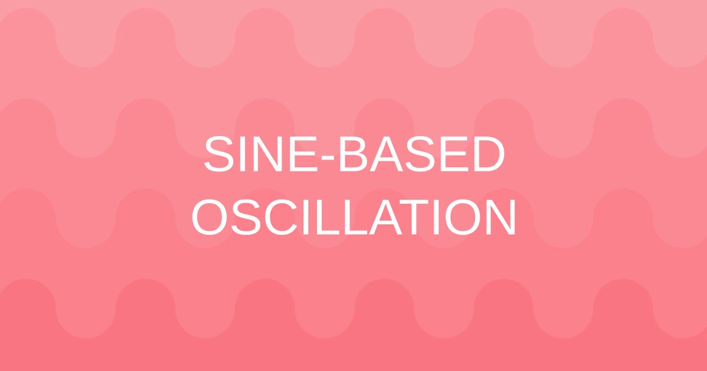

<!-- Tech badges with pastel colors -->

# Olá!

I'm a passionate **frontend developer** with a strong focus on building custom web applications mostly using **Vue** with some knowledge about **Web Components**.

With years of experience across various industries, I've contributed to **UI libraries**, optimized performance, and collaborated closely with cross functional teams to deliver seamless user experiences. My expertise includes modern frontend frameworks, component-driven development, and testing methodologies using tools like **Storybook** and **Vitest**.

## Open Source Projects

Salishan Keyboard / 2025-11-15

 

**Salishan** is a **keyboard layout for Salishan and neighboring Indigenous languages of the Pacific Northwest**. It extends the standard English keyboard with **dead keys for glottalization, acute accent, tilde, and other diacritics**, enabling efficient typing of **ejective, glottalized, and lateral consonants**, as well as **special vowels** used across multiple Salishan languages. The layout also includes **combining diacritics for rare tonal or phonetic markings**, making it a comprehensive tool for **linguists, language learners, and community members**.

Morfosis / 2025-09-06

 

Morfosis is a **Flutter app** for offline media conversion, focused on privacy and speed. Powered by FFmpeg, it lets users convert audio and video files between multiple formats entirely on their device, without requiring an internet connection.

| Queue (Empty) | Queue | Settings | About |
|---------------|-------|----------|-------|
|  |  |  |  |

> App preview

LoM DB / 2024-12-05

 

An interactive visual archive tracking all known server merges and top player data across regions in Legend of Mushrooms, built for clarity and community insight.

> Draco Ascension SVG Cinematic

> Servers' Size Comparison Graph

> Merge Tracker

> Servers' Age

Nano Grid / 2021-03-21

 

Nano Grid is a **Node module** and frontend toolkit powered by CSS and Web Components. It provides a lightweight, modular framework to build responsive layouts and interactive interfaces with minimal dependencies.

Romala / 2021-03-05

 

Romala is a **Debian package** that provides an extended keyboard layout for Romance languages. It includes dead keys, accents, and a rich set of math, logic, and special symbols, making typing in multiple languages fast, efficient, and expressive.

> Keyboard preview

## Experiments

3D CSS House / 2022/02/02

 

A lightweight 3D house visualizer built entirely with modern CSS and a bit of nested structure for clarity. It began as an experiment in recreating a simple architectural scene, but quickly grew into a full mini-environment with walls, roof, chimney, base, fence, and ground. The project uses pure CSS 3D transforms, no frameworks, libraries, or external rendering tools to generate depth, perspective, and animation, resulting in a clean, self-contained visual demo.

3D Map / 2022/01/24

 

A lightweight visualizer built with native Web Components and SVG, created as a refactor of a previous project that originally used Vue.js, Blender, and Konva. The original version started as a Google Maps-based app showing the cities where I’ve lived, studied, or worked. But as the map grew too large and visually restrictive, the project evolved into a custom-designed world.

3D Cube / 2021/02/27

 

A 3D color cube visualizer built with native Web Components and Three.js, this project renders thousands of colored cubes in a navigable 3D space. It includes optional grid and guide lines for orientation, interactive camera controls via OrbitControls, and a responsive renderer that adapts to window resizing, providing an intuitive and visually engaging way to explore color relationships in three dimensions.

## Research

Sine-Based Oscillation

 

This project aims to simplify how bouncing animations are calculated by removing the need for traditional conditional checks when an object reaches the edges of the screen. Instead, it uses a continuous filtering approach that naturally reverses direction, creating a smooth bounce effect without explicit boundary conditions. This technique can be applied to any scenario where an element needs to rebound (such as a ball moving around the screen or other looping, oscillating animations) making the underlying motion logic cleaner, more elegant, and easier to reuse in different programs.

